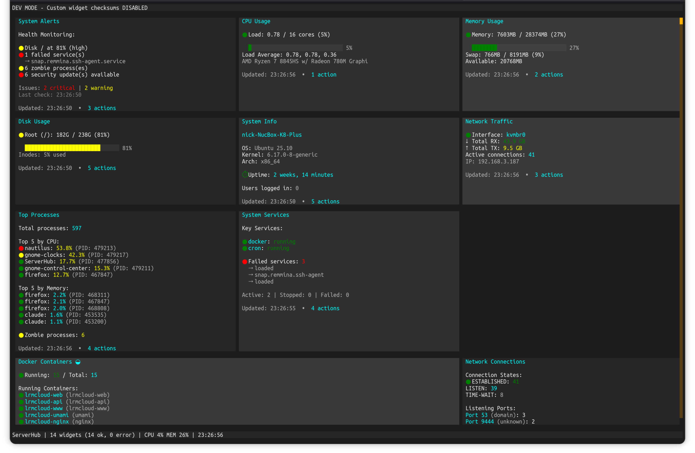

# ServerHub

[](LICENSE)
[](https://dotnet.microsoft.com/)
[]()

**An extensible server dashboard that doesn't just watch—it acts.**

ServerHub is a terminal control panel for servers and homelabs. Monitor your system, execute actions, and build custom monitoring for your specific setup—all without touching the codebase.

**Monitor. Act. Extend.**



**[View more screenshots →](docs/SCREENSHOTS.md)**

## What Makes ServerHub Different

**Extensible by design** - Write a script in any language (C#, Python, bash, Node.js, Go, Rust, or compiled binaries). If it outputs to stdout, it's a widget. Monitor anything: custom services, APIs, hardware you built yourself, scripts you already have. Widgets support expanded views - press Enter for full details beyond the dashboard summary.

**Context-aware actions** - Widgets don't just display data—they export actions based on what they're showing. A service widget shows different restart options depending on which services are running. An updates widget exports "Upgrade All" only when updates are available. Docker widget offers actions per container. Each widget adapts to the current state.

**Control, not just monitoring** - Upgrade packages, restart services, manage containers, trigger backups—execute actions with confirmation dialogs, progress tracking, and sudo support when needed. Your dashboard becomes a control panel.

**Security-first extensibility** - SHA256 validation for custom widgets with a documented threat model. Minimal environment variables. Path restrictions. Symlink blocking. Professional security without sacrificing flexibility.

## Core Features

- **14 bundled widgets** - CPU, memory, disk, network, Docker, systemd services, package updates, logs, SSL certificates, sensors, and more
- **Responsive layout** - 1-4 column layout adapts to terminal width
- **Custom widgets** - Write bash scripts to monitor anything specific to your setup
- **Action system** - Execute commands directly from widgets with progress tracking
- **SHA256 validation** - All custom widgets require checksum validation (development mode available)
- **YAML configuration** - Simple, version-controllable config files
- **Keyboard navigation** - Tab/Shift+Tab between widgets, arrow keys to scroll

## Requirements

- Linux (x86_64 or ARM64)
- Bash (for widget scripts)

No .NET runtime required - ServerHub ships as a self-contained binary.

## Installation

### Quick Install (Recommended)

Download and install the latest release:

```bash
curl -fsSL https://raw.githubusercontent.com/nickprotop/ServerHub/main/install.sh | bash
```

This automatically:
- Downloads the binary for your architecture
- Installs bundled widgets
- Adds `~/.local/bin` to your PATH
- Creates default config on first run

### Build from Source

For development or if you want to build from source:

```bash
git clone https://github.com/nickprotop/ServerHub.git
cd ServerHub
./build-and-install.sh
```

Requires .NET 9.0 SDK for building.

## Uninstall

To remove ServerHub from your system:

```bash
curl -fsSL https://raw.githubusercontent.com/nickprotop/ServerHub/main/uninstall.sh | bash
```

This removes:
- The ServerHub binary from `~/.local/bin`
- Bundled widgets from `~/.local/share/serverhub`
- Optionally, your configuration from `~/.config/serverhub` (the script will ask)

## Usage

```bash
serverhub                                    # Run with default config
serverhub myconfig.yaml                      # Use custom config file
serverhub --init-config config.yaml          # Create config by discovering widgets
serverhub --discover                         # Find and add custom widgets
serverhub --verify-checksums                 # Verify all widget checksums
serverhub --dev-mode                         # Development mode (see Security section)
serverhub --help                             # Show all options
```

### Creating Configurations

**First-time setup** - The default config (`~/.config/serverhub/config.yaml`) is automatically created on first run with all bundled widgets.

**Custom configurations** - Use `--init-config` to create a new configuration file by discovering available widgets:

```bash
# Create config with bundled widgets only
serverhub --init-config config.production.yaml

# Create config with bundled + custom widgets from specific directory
serverhub --init-config config.dev.yaml --widgets-path ./widgets/
```

**How it works:**
1. Starts with all 14 bundled widgets from the production template
2. Scans `~/.config/serverhub/widgets/` for custom widgets
3. Scans `--widgets-path` if provided
4. Generates config with appropriate `location` fields
5. Custom widgets have no checksums initially (security - requires `--discover` or `--dev-mode`)

**Note:** Custom config paths (non-default) are not auto-created. You must explicitly use `--init-config` to create them. This prevents accidental file creation from typos.

### Keyboard Shortcuts

| Key | Action |
|-----|--------|
| `Tab` / `Shift+Tab` | Navigate between widgets |
| `Arrow keys` | Scroll within focused widget |
| `F5` | Refresh all widgets |
| `Space` | Pause/resume refresh |
| `?` or `F1` | Show help |
| `Ctrl+Q` | Quit |

## Configuration

### Default Configuration

Configuration file location: `~/.config/serverhub/config.yaml`

On first run, ServerHub automatically creates this file with all bundled widgets configured.

For custom configuration paths, use `--init-config`:

```bash
# Create a new configuration file
serverhub --init-config myconfig.yaml

# Create config with widgets from a specific directory
serverhub --init-config myconfig.yaml --widgets-path ./widgets/
```

### Configuration Format

```yaml
default_refresh: 5

widgets:
  cpu:
    path: cpu.sh
    refresh: 2
    location: bundled  # Optional: bundled, custom, or auto (default)

  memory:
    path: memory.sh
    refresh: 2

  docker:
    path: docker.sh
    refresh: 30              # Dashboard refreshes every 30s
    expanded_refresh: 10     # Expanded dialog refreshes every 10s
    location: bundled

  my-custom:
    path: my-custom.sh
    location: custom
    sha256: a1b2c3d4...  # Required for custom widgets (use --discover)
    refresh: 10

layout:
  order:
    - cpu
    - memory
    - docker
    - my-custom

breakpoints:
  double: 100    # 2 columns at 100+ chars
  triple: 160    # 3 columns at 160+ chars
  quad: 220      # 4 columns at 220+ chars
```

**Refresh Intervals:**

Each widget can have two refresh intervals:

- `refresh` - Refresh rate for the main dashboard (required)
- `expanded_refresh` - Refresh rate when viewing the expanded dialog (optional)

If `expanded_refresh` is not set, the widget uses the `refresh` value for both views.

**Common patterns:**

- **Slower expanded refresh** - Reduce resource usage when viewing details:
  ```yaml
  alerts:
    refresh: 30
    expanded_refresh: 60  # Slower - alerts don't change often
  ```

- **Faster expanded refresh** - More detail when actively monitoring:
  ```yaml
  docker:
    refresh: 30
    expanded_refresh: 10  # Faster when viewing container details
  ```

- **Real-time monitoring** - Keep the same rate for both:
  ```yaml
  cpu:
    refresh: 2  # No expanded_refresh - uses 2s for both views
  ```

### Widget Path Resolution

The `location` field controls where ServerHub searches for widget scripts:

- `location: bundled` - Search only in `~/.local/share/serverhub/widgets/`
- `location: custom` - Search only in `~/.config/serverhub/widgets/` and `--widgets-path`
- `location: auto` (or omit) - Search all directories in priority order: `--widgets-path` → `~/.config/serverhub/widgets/` → `~/.local/share/serverhub/widgets/` (default)

**Use cases:**
- Override a bundled widget with a custom version while keeping both
- Explicitly use the bundled version when custom exists
- Have multiple versions of the same widget (e.g., `cpu` bundled, `cpu_1` custom)

When using `--init-config` with `--widgets-path`, widgets found in the custom path are added with `location: custom` and unique IDs if filenames conflict with bundled widgets.

See [config.example.yaml](config.example.yaml) for full configuration options.

## Bundled Widgets

| Widget | Description |
|--------|-------------|
| `cpu` | CPU usage and load average |
| `memory` | Memory and swap usage |
| `disk` | Disk space usage |
| `network` | Network interface statistics |
| `processes` | Top processes by CPU/memory |
| `sysinfo` | System information (hostname, uptime, kernel) |
| `docker` | Docker container status |
| `services` | Systemd service status |
| `updates` | Available package updates |
| `alerts` | System health alerts |
| `sensors` | Hardware temperature sensors |
| `netstat` | Network connections |
| `logs` | Recent system log entries |
| `ssl-certs` | SSL certificate expiry status |

## Marketplace

Discover and install community-contributed widgets from the ServerHub marketplace.

### Browse and Search

```bash
# Search for widgets
serverhub marketplace search monitoring

# List all widgets
serverhub marketplace list

# List by category
serverhub marketplace list --category monitoring

# Get detailed information
serverhub marketplace info username/widget-name
```

### Install Widgets

```bash
# Install latest version
serverhub marketplace install username/widget-name

# Install specific version
serverhub marketplace install username/widget-name@1.0.0

# View installed marketplace widgets
serverhub marketplace list-installed
```

### Security & Verification

The marketplace uses a security-first approach:

- **SHA256 checksums** - All widgets have mandatory checksums verified during installation
- **Verification tiers** - Clear badges indicate review status:
  - ✓ **Verified** (green) - Code reviewed by ServerHub maintainers
  - ⚡ **Community** (yellow) - Multiple installs, no reported issues
  - ⚠ **Unverified** (red) - New or untested, requires explicit confirmation
- **GitHub-only hosting** - Widgets must be hosted on GitHub releases
- **Dependency checking** - Required system commands verified before installation
- **Code transparency** - All widget code is publicly reviewable

**You are responsible for reviewing code before installing unverified widgets.**

### Contributing Widgets

Want to share your widget with the community?

1. Create a GitHub repository with your widget
2. Create a GitHub release with the widget script
3. Submit a manifest to [serverhub-registry](https://github.com/nickprotop/serverhub-registry)

See the [Contributing Guide](https://github.com/nickprotop/serverhub-registry/blob/main/docs/CONTRIBUTING.md) for details.

## Custom Widgets

Write widgets in any language - C# scripts, bash, Python, Node.js, Go, Rust, or compiled binaries. As long as it outputs to stdout following our protocol, it works.

Place custom widget scripts in `~/.config/serverhub/widgets/`.

**All custom widgets require SHA256 checksum validation** (see Security section below).

```bash
# Discover new widgets interactively (recommended)
serverhub --discover

# Verify checksums for all configured widgets
serverhub --verify-checksums
```

### Widget Protocol (Brief)

Widgets output structured text to stdout:

```bash
echo "title: My Widget"
echo "row: [status:ok] Everything is fine"
echo "row: [progress:75:inline]"
echo "row: [grey70]Last updated: $(date)[/]"
```

See [docs/WIDGET_PROTOCOL.md](docs/WIDGET_PROTOCOL.md) for the full protocol reference.

### Example Use Cases

Real-world examples showing custom widgets for specific scenarios:

- **Development Droplet** - Monitor APIs, Docker services, deployments with one-click actions
- **Homelab Server** - Track Proxmox VMs, NAS health, backups with control actions
- **Production Monitor** - Service health, error logs, SSL certs with emergency actions

See [docs/EXAMPLES.md](docs/EXAMPLES.md) for complete working examples with scripts.

## Security

### Why This Matters

Widgets are **executable scripts that run with your user privileges**. A malicious widget could read your files, make network requests, or do anything else you can do. We'd rather be annoying about checksums than watch your server have a very bad day.

### Threat Model

**What we protect against:**

| Threat | Protection |
| --- | --- |
| **Malicious custom widgets** | Checksum requirement forces you to review code before trusting |
| **Tampering after trust** | Modified files fail checksum validation and won't run |
| **Copy-paste attacks** | We don't auto-show checksums on failure (see [Why We Don't Auto-Generate Checksums](#why-we-dont-auto-generate-checksums)) |
| **Accidental execution of untrusted code** | Unknown widgets are blocked by default |
| **Symlink attacks** | Symlinks are detected and blocked during validation |
| **Path traversal** | Scripts must be within allowed widget directories |
| **Environment variable leakage** | Widgets run with minimal environment variables |

**What we DON'T protect against:**

| Threat | Notes |
| --- | --- |
| **Compromised build environment** | If attackers modify bundled checksums at build time, they can ship malicious code. Mitigation: reproducible builds, signed releases (future) |
| **You approving malicious code** | If you `--discover` a widget and approve without reading it, that's on you |
| **Privilege escalation** | Widgets run as your user. If you run ServerHub as root, widgets run as root. **Don't do this.** |
| **TOCTOU race conditions** | Small window between checksum validation and execution. Low risk in practice |
| **Side-channel attacks** | Widget output is displayed; timing or output analysis is possible |

### Trust Hierarchy

| Source | Trust Level | Checksum Source | Failure Behavior |
| --- | --- | --- | --- |
| **Bundled widgets** | Highest | Hardcoded at build time (maintainer-reviewed) | Widget disabled with error message in widget area |
| **Custom widgets** | User-verified | You add `sha256` to config after reviewing code | Widget disabled with error message in widget area |

### Validation Layers

ServerHub performs multiple security checks before executing any widget script:

1. **File Existence** - Script file must exist at the specified path
2. **Symlink Detection** - Symlinks are blocked (prevents following malicious links)
3. **Path Restriction** - Script must be within allowed widget directories:
   - `--widgets-path` (if specified)
   - `~/.config/serverhub/widgets/` (custom widgets)
   - `~/.local/share/serverhub/widgets/` (bundled widgets)
4. **Executable Permissions** - Script must have execute permission (Unix systems)
5. **SHA256 Checksum** - Script content must match trusted checksum

Additionally during execution:
- **Minimal Environment** - Widgets run with cleared environment variables (only PATH, HOME, USER, LANG)
- **Timeout Enforcement** - Scripts are killed if they exceed configured timeout

### Failure Behavior

| Scenario | Behavior |
| --- | --- |
| Bundled widget checksum mismatch | Widget refuses to run, displays "Checksum mismatch" error |
| Bundled widget file missing | Widget refuses to run, displays "Widget not found" error |
| Custom widget missing checksum | Widget refuses to run, displays "No checksum configured" with instructions |
| Custom widget checksum mismatch | Widget refuses to run, displays "Checksum mismatch" error with expected vs actual |
| Custom widget file missing | Widget refuses to run, displays "Widget not found" error |
| Symlink detected | Widget refuses to run, displays "Symlinks are not allowed" error |
| Path outside allowed directories | Widget refuses to run, displays "Script path is not within allowed directories" error |
| Script not executable | Widget refuses to run, displays "Script is not executable" with chmod instructions |

In all cases, **other widgets continue to function normally**. A single compromised or misconfigured widget doesn't take down your dashboard.

### How It Works

1. **Bundled widgets** (`~/.local/share/serverhub/widgets/`) are pre-validated with checksums baked into the application at build time. They just work.

2. **Custom widgets** (`~/.config/serverhub/widgets/`) **require** a `sha256` checksum in your config:

```yaml
widgets:
  my-widget:
    path: my-widget.sh
    sha256: a1b2c3d4e5f6...  # Required!
    refresh: 10
```

Without a checksum, custom widgets will not run. This is intentional.

### Adding Custom Widgets Safely

**Option 1: Initialize Config with Discovery (Recommended for new configs)**

```bash
# Create config with auto-discovered widgets
serverhub --init-config config.yaml --widgets-path ./widgets/

# Then review and add checksums interactively
serverhub --discover
```

This discovers all widgets in bundled and custom locations, generating a config file. Custom widgets are added **without checksums** (security), requiring you to review them via `--discover` or run with `--dev-mode`.

**Option 2: Discovery (Recommended for existing configs)**

```bash
serverhub --discover
```

This shows you a code preview of each unconfigured widget before adding it. When you approve, the checksum is captured at that moment—the "trusted moment" when you've actually seen what the code does.

**Option 3: Manual**

```bash
# 1. Read the script yourself
cat ~/.config/serverhub/widgets/my-widget.sh

# 2. Calculate the checksum
sha256sum ~/.config/serverhub/widgets/my-widget.sh

# 3. Add to config with the checksum
nano ~/.config/serverhub/config.yaml
```

### Configuration File Creation

ServerHub's auto-creation behavior is intentionally restrictive to prevent security issues:

**Auto-created:** `~/.config/serverhub/config.yaml` (default path only)
- Created automatically on first run
- Contains only bundled widgets with verified checksums
- Safe for immediate use

**Not auto-created:** Custom config paths (e.g., `config.dev.yaml`, `myconfig.yaml`)
- Prevents accidental file creation from typos (e.g., `config.developmnet.yaml`)
- Prevents wrong defaults when using `--widgets-path`
- Must use `--init-config` explicitly to create

**Why this matters:**
Running `serverhub config.dev.yaml --widgets-path ./widgets/` should fail if the config doesn't exist, not silently create a config that expects bundled widgets while you're pointing at custom widgets. This mismatch causes path resolution issues and confusing behavior.

### Why We Don't Auto-Generate Checksums

When a widget fails validation, ServerHub does **not** helpfully show you "just add this checksum." That would defeat the entire security model:

1. Attacker modifies a widget file
2. You run ServerHub, it fails with "checksum mismatch"
3. If it showed the new checksum, you'd copy-paste it without thinking
4. Congratulations, you've just blessed malicious code

Instead, you must go through a "trusted moment"—either `--discover` (which shows the code) or manually running `sha256sum` (which requires conscious action).

### Why SHA256?

We use SHA256 for checksum validation. While even older algorithms like SHA1 would provide sufficient collision resistance for integrity checking of small scripts, SHA256 is:

- The current industry standard
- Unlikely to raise concerns in security audits
- Widely supported and understood
- Future-proof for the foreseeable future

### Development Mode

For **widget development only**, you can skip custom widget checksum validation:

```bash
serverhub --dev-mode --widgets-path ./my-dev-widgets
```

Dev mode indicators:
- Orange border around the dashboard
- Warning in status bar
- Startup dialog requiring acknowledgment

Important notes:
- Bundled widgets are **still validated** even in dev mode
- Symlink, path, and permission checks **still apply** in dev mode
- This is for development, not for "I don't want to deal with checksums"
- **Never use `--dev-mode` in production**

### Verification

Verify all configured widget checksums:

```bash
serverhub --verify-checksums
```

Example output:
```
Verifying widget checksums...

  cpu                  VALID (bundled)
  memory               VALID (bundled)
  my-custom-widget     VALID (config)
  untrusted-widget     NO CHECKSUM
      Run --discover or manually verify before adding checksum
  tampered-widget      MISMATCH (config)
      Expected: a1b2c3d4e5f6...
      Actual:   f9e8d7c6b5a4...
  missing-widget       NOT FOUND

Results: 3 valid, 1 mismatch, 2 missing/no-checksum
```

Exit codes:
- `0` - All widgets valid
- `1` - One or more failures (mismatch, missing checksum, or not found)

Use in scripts and CI/CD:
```bash
# Pre-deployment check
serverhub --verify-checksums || { echo "Widget validation failed"; exit 1; }
```

### Recommendations

1. **Never run ServerHub as root** — widgets inherit your privileges
2. **Actually read widget code** during `--discover` — don't just approve blindly
3. **Run `--verify-checksums` periodically** — catch tampering early (add to cron/systemd timers)
4. **For high-security environments** — stick to bundled widgets only
5. **Review widget updates** — if you update a custom widget, you'll need to update its checksum (which forces a re-review)
6. **Avoid symlinks** — place widget scripts directly in widget directories, don't symlink to other locations
7. **Check permissions** — ensure widget scripts have appropriate file permissions (chmod +x for execution, not world-writable)

### Future Considerations

These features are not currently implemented but are under consideration:

**Signed Widgets**
- GPG-signed widgets with trusted key management
- Would enable a widget ecosystem where you trust maintainers rather than reviewing every line
- More complex but scales better than per-widget checksums

**Reproducible Builds**
- Deterministic builds to verify bundled widget checksums independently
- Build attestation for supply chain security
- Allow independent verification of bundled widgets

## Built With

- [SharpConsoleUI](https://github.com/nickprotop/ConsoleEx) - A .NET library for building terminal user interfaces with responsive layouts and window management.

## Author

**Nikolaos Protopapas**

- GitHub: [@nickprotop](https://github.com/nickprotop)

## License

This project is licensed under the MIT License - see the [LICENSE](LICENSE) file for details.
