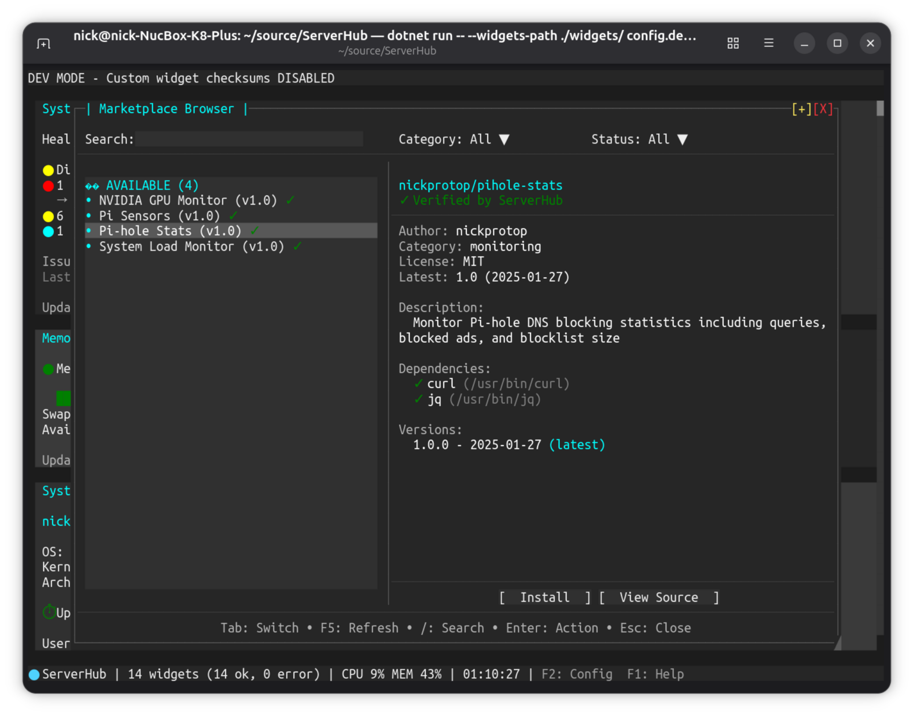

# ServerHub Marketplace

The ServerHub Marketplace is a community-driven registry for sharing and discovering custom widgets. It provides a secure, centralized way to extend ServerHub with widgets created by the community.

**[Browse the Marketplace →](https://nickprotop.github.io/serverhub-registry/)**

## Overview

The marketplace allows you to:
- **Discover** widgets created by the community
- **Install** widgets with automatic checksum verification and dependency checking
- **Share** your own widgets with other ServerHub users
- **Browse** by category (monitoring, infrastructure, development, databases, networking, security, cloud, utilities)

All marketplace widgets are hosted on GitHub and verified with SHA256 checksums. The marketplace uses a tiered verification system (Verified ✓, Community ⚡, Unverified ⚠) to help you make informed decisions about which widgets to trust.

**For detailed marketplace documentation, widget registry, and full contributing guide:**
**→ [serverhub-registry](https://github.com/nickprotop/serverhub-registry)**

## Using the Marketplace

### Interactive Browser (TUI)

**Quick Start:** Press `F3` in the ServerHub dashboard to open the marketplace browser.



The TUI marketplace browser provides an interactive way to discover and install widgets directly from your terminal:

**Features:**
- Visual widget cards with descriptions and metadata
- Filter by category (monitoring, infrastructure, development, databases, networking, security, cloud, utilities)
- Filter by verification status (✓ Verified, ⚡ Community, ⚠ Unverified)
- View dependencies and system requirements before installation
- Direct links to source code repositories
- One-click installation with automatic checksum verification
- Real-time install progress and feedback
- Automatic dashboard reload after installation

**Installation Path:**
- Widgets install to `~/.config/serverhub/widgets/` by default
- If you started ServerHub with `--widgets-path /custom/path`, widgets install to that location
- Both CLI and TUI respect your startup `--widgets-path` configuration
- The install path is determined when ServerHub starts and applies to all marketplace operations

**Example Workflow:**
1. Start ServerHub: `serverhub` (or `serverhub --widgets-path /my/widgets`)
2. Press `F3` to open marketplace browser
3. Browse or filter widgets by category/status
4. Select a widget to view details
5. Click "Install" button
6. Review dependencies and confirm
7. Widget is downloaded, verified with SHA256, and added to your config
8. Dashboard automatically reloads with the new widget

### Web Browser

Visit the [Marketplace Browser](https://nickprotop.github.io/serverhub-registry/) to explore widgets visually in your web browser with filtering, categories, and verification badges.

### Command Line (CLI)

For scripting or automation, use the CLI commands:

```bash
# Search by keyword
serverhub marketplace search monitoring

# List all widgets
serverhub marketplace list

# List by category
serverhub marketplace list --category monitoring

# Get detailed information about a widget
serverhub marketplace info username/widget-name
```

### Install and Manage Widgets

```bash
# Install latest version
serverhub marketplace install username/widget-name

# Install specific version
serverhub marketplace install username/widget-name@1.0.0

# View installed widgets
serverhub marketplace list-installed

# Uninstall widget
serverhub marketplace uninstall username/widget-name
```

The installer automatically:
- Downloads from GitHub releases
- Verifies SHA256 checksums
- Checks for required dependencies
- Installs to `~/.config/serverhub/widgets/` by default, or to `--widgets-path` if you started ServerHub with that option
- Adds the widget to your config with checksum
- Both CLI and TUI respect your startup configuration

## Security & Verification

The marketplace uses a security-first approach:

- **SHA256 checksums** - Verified during installation, automatically added to your config
- **GitHub-only hosting** - Source code is publicly reviewable
- **Dependency checking** - Required commands verified before installation
- **Verification tiers** - Clear badges indicate trust level:
  - ✓ **Verified** - Code reviewed by ServerHub maintainers
  - ⚡ **Community** - Multiple installs, no reported issues
  - ⚠ **Unverified** - New or untested, requires explicit confirmation

**You are responsible for reviewing code before installing unverified widgets.** Always review the source code and verify the author before installing.

## Contributing Widgets

Want to share your widget with the community?

### Submission Process

1. **Create and test your widget** - Follow the [Widget Protocol](WIDGET_PROTOCOL.md) and test thoroughly
2. **Host on GitHub** - Create a repository and GitHub release with your widget script
3. **Fork [serverhub-registry](https://github.com/nickprotop/serverhub-registry)** - Create a feature branch
4. **Add widget files** to `widgets/<category>/<username-widget-name>/`:
   ```
   widgets/monitoring/johndoe-api-monitor/
   ├── manifest.yaml          # Widget metadata, URLs, checksums
   ├── README.md              # User-facing documentation
   └── v1.0.0/
       └── api-monitor.sh     # Your widget script
   ```
5. **Submit a pull request** - Maintainers will review and assign verification status

### What Gets Reviewed

- **Security** - Code review for potential security issues
- **Quality** - Does it follow the widget protocol correctly?
- **Documentation** - Clear README with installation and usage instructions
- **Dependencies** - All required commands documented in manifest
- **Testing** - Widget must work as described

### Verification Levels

After review, your widget receives a status:
- ✓ **Verified** - Code reviewed and approved by maintainers
- ⚡ **Community** - Multiple installs, good community feedback
- ⚠ **Unverified** - New submission, awaiting review/installs

See the [Contributing Guide](https://github.com/nickprotop/serverhub-registry/blob/main/docs/CONTRIBUTING.md) for complete details on manifest format, directory structure, and review criteria.

## More Information

For complete marketplace documentation, widget registry, manifest specifications, and contributing guidelines, visit:

**[serverhub-registry](https://github.com/nickprotop/serverhub-registry)**
