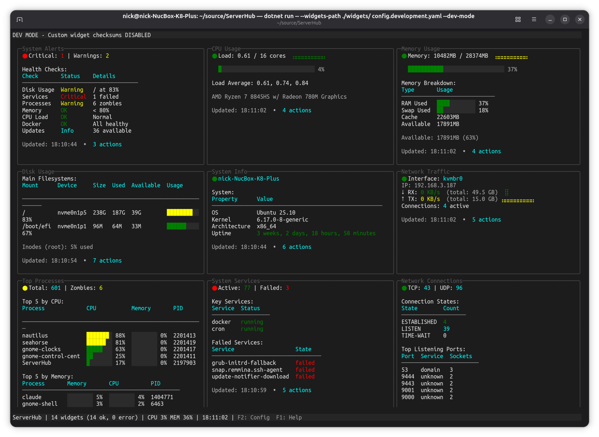
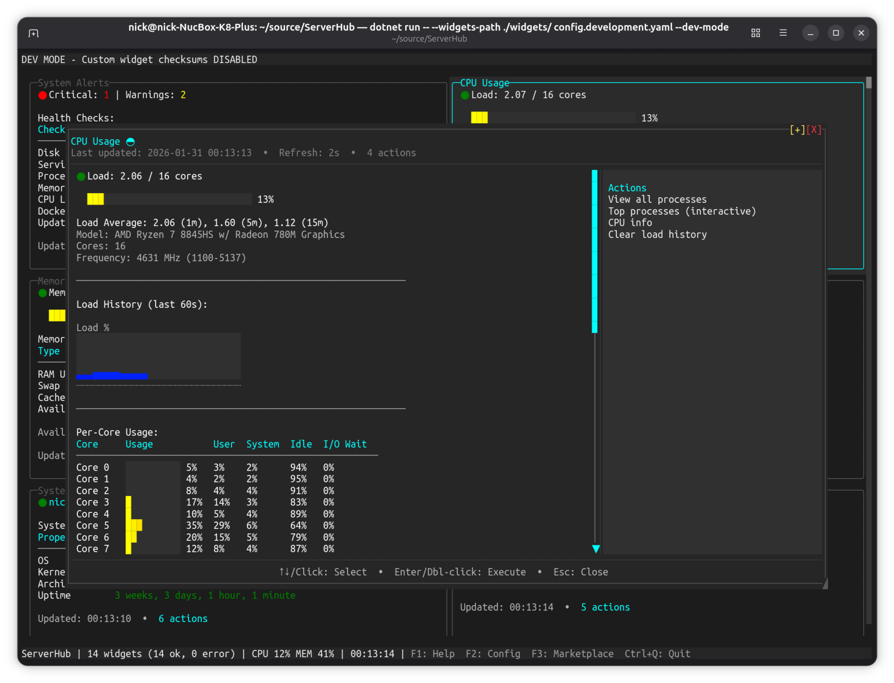
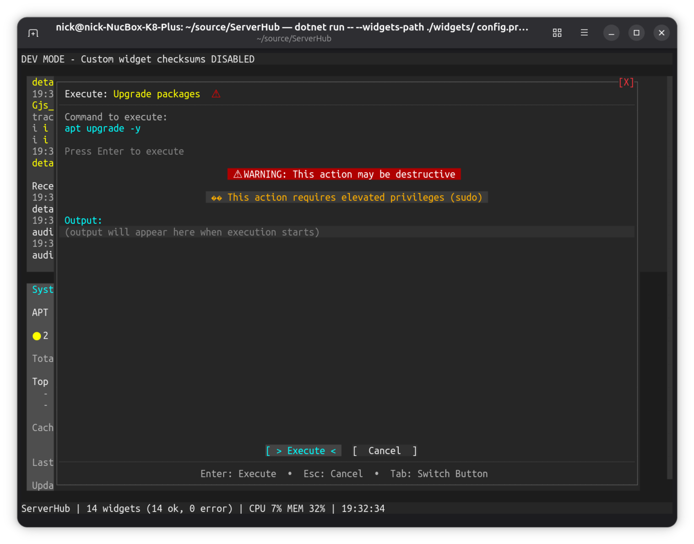
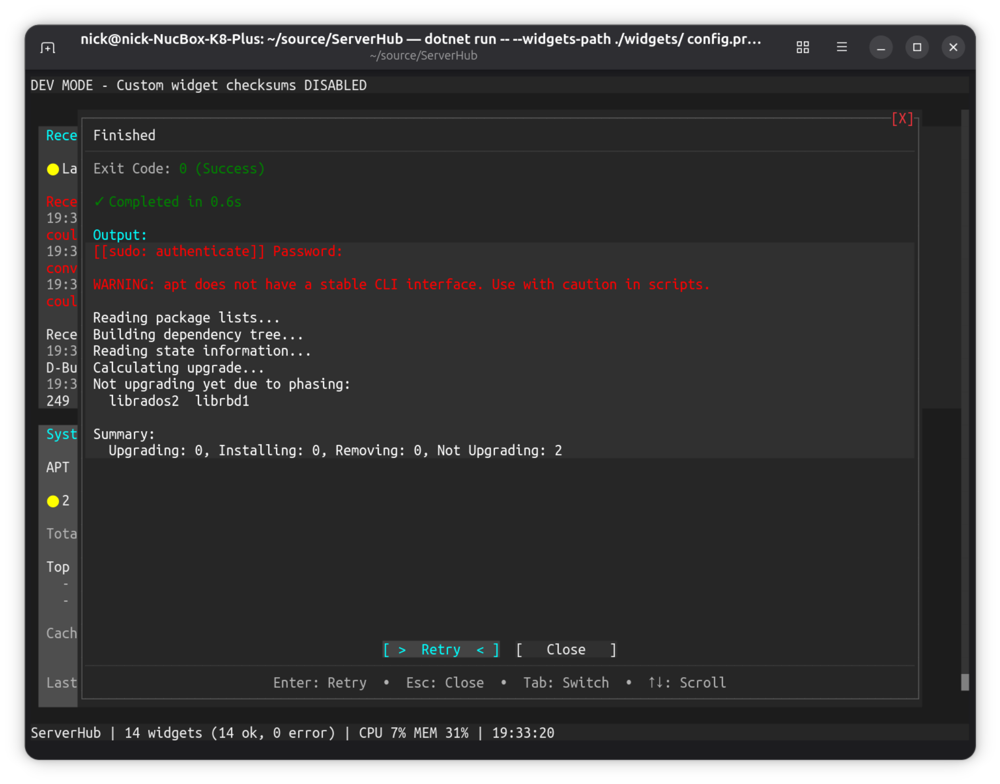

# ServerHub Screenshots

Visual showcase of ServerHub's features and interface.

---

## Dashboard Overview

The main dashboard showing multiple widgets in a responsive grid layout. Displays system monitoring including alerts, CPU usage, memory usage, disk space, system info, and network traffic. Widgets adapt to terminal width and provide at-a-glance visibility of server health.

**Features shown:**
- Multi-column responsive layout
- Color-coded status indicators
- Real-time system metrics
- Action buttons per widget
- Clean, minimal terminal UI
- Orange border indicating dev mode

---

## Widget Expanded View

Press Enter on any widget to see the full detailed view. This screenshot shows the System Alerts widget expanded with comprehensive health monitoring:

**Expanded details include:**
- Detailed health checks (disk space, failed services, zombie processes, package updates)
- Complete filesystem status for all partitions
- Failed services with full names
- SSL certificate expiration status
- Recent system errors from logs
- Action buttons for immediate remediation

The expanded view shows everything the widget knows - while the dashboard shows summaries, the expanded view provides full diagnostic information.

---

## Action Confirmation Dialog

Before executing any action, ServerHub shows a confirmation dialog with:

**Safety features:**
- Action name and description
- Exact command that will be executed
- Warning for destructive actions (`[danger]` flag)
- Sudo privilege notification when required
- Clear Execute/Cancel buttons
- Command preview for transparency

This screenshot shows the "Upgrade packages" action about to execute `apt upgrade -y` - marked as both dangerous and requiring sudo.

---

## Sudo Authentication

When an action requires elevated privileges, ServerHub prompts for your sudo password in a secure dialog:

**Security:**
- Password is masked during input
- Password used once and immediately discarded
- Clear indication of which action needs sudo
- Shows exact command being executed with sudo
- Orange border matches dev mode indicator
- Cancel option to abort

Password authentication happens at execution time, not when starting ServerHub.

---

## Action Execution Result

After executing an action, ServerHub displays the complete output in a scrollable dialog:

**Result details:**
- Exit code (success/failure indicator)
- Execution time
- Complete stdout/stderr output
- Retry option if command failed
- Close button to return to dashboard
- Real-time output streaming during execution

This screenshot shows a successful package upgrade completion with full apt output, including the warning about apt's CLI stability and the upgrade summary showing 2 packages not upgrading due to phasing.

---

## Marketplace Browser

Press `F3` to open the interactive marketplace browser for discovering and installing community widgets:

**Browser features:**
- Visual widget cards with descriptions and metadata
- Category filtering (monitoring, infrastructure, development, databases, etc.)
- Verification status badges (✓ Verified, ⚡ Community, ⚠ Unverified)
- Dependency information and system requirements
- Direct source code links to GitHub repositories
- One-click installation with automatic checksum verification
- Real-time install progress and feedback

**Installation:**
- Widgets install to `~/.config/serverhub/widgets/` by default
- Respects `--widgets-path` if you started ServerHub with a custom path
- Automatically adds widget to config with checksum
- Dashboard reloads automatically after installation

The marketplace provides both TUI (F3) and CLI (`serverhub marketplace`) interfaces for maximum flexibility.

---

## Key Interface Features

### Context-Aware Actions
Actions adapt based on widget state:
- Services show "Start" when stopped, "Stop/Restart" when running
- Docker containers offer per-container actions
- Updates widget shows "Upgrade All" only when updates are available

### Visual Feedback
- **Status indicators:** Color-coded icons for ok/warning/error
- **Progress bars:** Visual representation of resource usage
- **Timestamp tracking:** Last update time on each widget
- **Action counts:** Number of available actions shown per widget

### Keyboard Navigation
- `Tab/Shift+Tab` - Navigate between widgets
- `Enter` - Open expanded view or execute action
- `Esc` - Close dialogs
- `Arrow keys` - Scroll within widgets
- `F2` - Configure widgets (add, edit, reorder)
- `F3` - Browse marketplace widgets
- `F5` - Refresh all widgets
- `Space` - Pause/resume auto-refresh

### Development Mode
The orange border in these screenshots indicates dev mode (`--dev-mode` flag), which disables custom widget checksum validation for development purposes. In production, this border is not present and all custom widgets require SHA256 validation.

---

See [WIDGET_PROTOCOL.md](WIDGET_PROTOCOL.md) for widget development details and [EXAMPLES.md](EXAMPLES.md) for custom widget examples.
